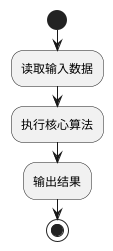

# {算法编号} {算法名称}

## 算法模型基本信息

### 输入数据要求

> 必须按以下格式填写：每个数据块先写一行“数据名称”，下一行写“(`文件名`)”，再从下一行开始写三列表格；表头必须为 `字段中文`、`字段英文`、`字段类型`，不得改名、合并列或写成列表。

{输入数据名}
(`{输入文件名}`)

| 字段中文    | 字段英文      | 字段类型        |
| ----------- | ------------- | --------------- |
| {字段中文1} | `{字段英文1}` | `int/float/str` |
| {字段中文2} | `{字段英文2}` | `int/float/str` |

### 输出数据要求

> 必须按以下格式填写：每个数据块先写一行“数据名称”，下一行写“(`文件名`)”，再从下一行开始写三列表格；表头必须为 `字段中文`、`字段英文`、`字段类型`，不得改名、合并列或写成列表。

{输出数据名}
(`{输出文件名}`)

| 字段中文    | 字段英文      | 字段类型        |
| ----------- | ------------- | --------------- |
| {字段中文1} | `{字段英文1}` | `int/float/str` |
| {字段中文2} | `{字段英文2}` | `int/float/str` |

## 算法模型简介

{算法模型文字简介。应聚焦算法原理，不写代码、工程文件、运行命令或实现细节；可附带必要公式并解释变量含义。}

公式规范：行内公式使用 `$...$` 或 `\(...\)`；独立公式使用 `$$...$$` 或 `\[...\]`。只使用上下标、分式、根号、求和、积分、极值、希腊字母、比较符、集合符号和 `\operatorname{...}`、`\mathrm{...}`、`\text{...}` 等word支持的命令。禁止使用自定义宏、公式编号/引用，以及 `equation`、`align`、`aligned`、`gather`、`multline`、`array`、`matrix` 等 LaTeX 环境；多行推导拆成多个独立公式块。

## 算法模型流程图



## 测试数据与配置

本节记录本次测试实际采用的输入数据、配置参数和数据样例，用于说明模型测试所依据的原始实验数据。

### 测试输入文件清单

| 文件名      | 格式                                    | 是否必须 | 说明       |
| ----------- | --------------------------------------- | -------- | ---------- |
| `{文件名1}` | `csv/json/toml/xlsx/npz/parquet/xml` 等 | 是       | {简要说明} |
| `{文件名2}` | `csv/json/toml/xlsx/npz/parquet/xml` 等 | 是       | {简要说明} |

### 实际输入数据

> 按实际文件展开为小节：表格型数据写真实行节选；JSON/TOML/XML 等纯文本数据写关键片段；NPZ 写数组名、shape、dtype、索引范围、对象顺序和关键数值或矩阵切片；二进制权重写文件作用、大小和可验证摘要。节选数据需要在数据名称后面添加“（节选）”。

#### {输入数据名称1}

(`{输入文件名1}`)

{用一段话说明数据含义}

| {字段中文1} | {字段中文2} | {字段中文3} |
| ----------- | ----------- | ----------- |
| {真实值1}   | {真实值2}   | {真实值3}   |
| {真实值4}   | {真实值5}   | {真实值6}   |

#### {输入数据名称2}

(`{输入文件名2}`)

{用一段话说明数据含义}

```json
{
  "{真实键}": "{真实值}"
}
```

### 可泛化参数

在不修改算法核心逻辑的前提下，可通过调整以下参数改变算法行为或适配不同场景。

**`data/input/{配置文件名}`**

{对该配置文件的整体用途作一句话描述。}

| 参数名    | 类型                 | 默认值     | 取值范围     | 含义与影响               |
| --------- | -------------------- | ---------- | ------------ | ------------------------ |
| `{参数1}` | `int/float/str/bool` | `{默认值}` | `{取值范围}` | {参数含义及修改后的影响} |

## 测试过程

本次测试通过容器方式复现算法运行过程，将输入数据目录和输出数据目录挂载到容器内，运行结束后检查输出文件及关键结果。

### 运行方式

```bash
# 加载镜像
docker load -i {打包编号}.tar
```

```bash
# Linux/macOS
docker run --rm \
  -v $(pwd)/data/input:/app/data/input \
  -v $(pwd)/data/output:/app/data/output \
  {打包编号}:v1
```

```powershell
# Windows PowerShell
docker run --rm `
  -v "${PWD}/data/input:/app/data/input" `
  -v "${PWD}/data/output:/app/data/output" `
  {打包编号}:v1
```

将所需输入文件放入 `data/input/` 目录，运行结束后结果文件生成于 `data/output/`。

### 输出文件清单

| 文件名      | 格式                                    | 说明       |
| ----------- | --------------------------------------- | ---------- |
| `{文件名1}` | `csv/json/toml/xlsx/npz/parquet/xml` 等 | {简要说明} |
| `{文件名2}` | `csv/json/toml/xlsx/npz/parquet/xml` 等 | {简要说明} |

## 测试结果

> 按实际文件展开为小节：表格型数据写真实行节选；JSON/TOML/XML 等纯文本数据写关键片段；NPZ 写数组名、shape、dtype、索引范围、对象顺序和关键数值或矩阵切片；二进制权重写文件作用、大小和可验证摘要。节选数据需要在数据名称后面添加“（节选）”。

### {输出数据名称1}

(`{输出文件名1}`)

{用一段话说明数据含义}

| {字段中文1} | {字段中文2} | {字段中文3} |
| ----------- | ----------- | ----------- |
| {真实值1}   | {真实值2}   | {真实值3}   |
| {真实值4}   | {真实值5}   | {真实值6}   |

### {输出数据名称2}

(`{输出文件名2}`)

{用一段话说明数据含义}

```json
{
  "{真实键}": "{真实值}"
}
```

## 测试结论

本次测试使用 {输入数据名称1}、{输入数据名称2}和{配置文件名称}作为输入，在容器环境中按报告记录的运行方式完成执行，运行过程未出现错误。

测试完成后，模型生成 {输出数据名称1}、{输出数据名称2} 等输出文件。经核验，输出文件格式与“输出数据要求”一致，能够满足{模型功能}。

综上，{算法名称}（{算法编号}）在本次测试数据和配置条件下通过运行测试，可作为同行专家评审的支撑材料。
